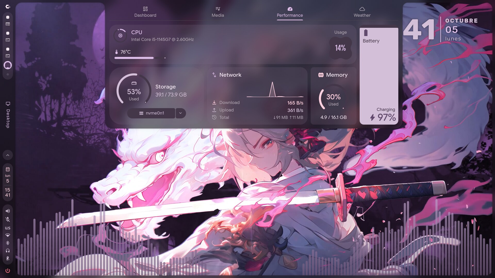
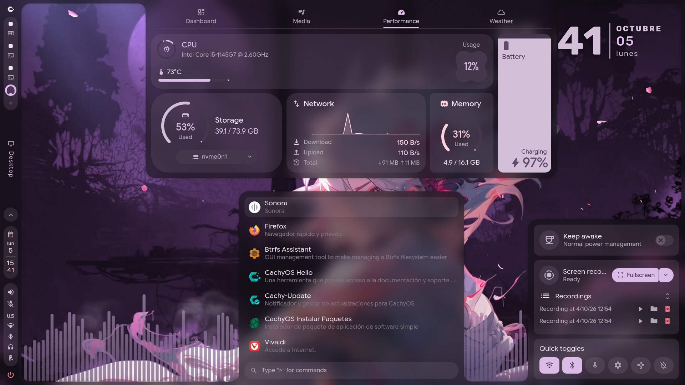

# dotfiles · Hyprland + Caelestia on CachyOS

My desktop setup: Hyprland running the Caelestia shell, with Material You theming, blur and translucency, and an animated wallpaper. Everything is written in Lua.





## Stack

| Component | Details |
|---|---|
| Distro | CachyOS (Arch Linux) |
| Compositor | Hyprland 0.56, Lua configuration |
| Shell | caelestia-shell 2.5 + caelestia-cli |
| Theming | Material You (color schemes generated by Caelestia) |
| Login shell | fish |

## Layout

| Path | Contents |
|---|---|
| `.config/hypr/hyprland.lua` | Main loader |
| `.config/hypr/hyprland/` | Modules: animations, decorations, autostart, keybinds, window rules, input... |
| `.config/hypr/variables.lua`, `scheme/`, `utils/` | Variables, color scheme and helper functions |
| `.config/hypr/config/`, `noctalia.lua` | CachyOS dots modules (not loaded by the current loader) |
| `.config/caelestia/` | `shell.json`, user overrides and fish config |
| `.local/bin/live-wallpaper.sh` | Animated wallpaper script |

## Customizations

- Blur with `brightness = 0.8` and translucent layers on the Caelestia panels
- Animated wallpaper launched from `execs.lua`
- `us` keyboard layout with the `altgr-intl` variant
- Custom window rules (browsers on workspace 2, music player on a special workspace)

## Restore on a fresh install

1. Install Caelestia by following its [README](https://github.com/caelestia-dots/caelestia) (clone into `~/.local/share/caelestia` and run `install.fish`).
2. Pull these dotfiles on top:

```fish
git clone --bare https://github.com/keity-mo/dotfiles.git ~/.dotfiles.git
alias dot 'git --git-dir=$HOME/.dotfiles.git --work-tree=$HOME'
dot config status.showUntrackedFiles no
dot checkout
```

If `checkout` complains about files that would be overwritten, move them to a `.bak` and run it again.

## How it is versioned

A *bare* repository in `~/.dotfiles.git` with `$HOME` as the work tree, managed through the `dot` alias:

```fish
dot add -u && dot commit -m "message" && dot push
```

## Credits

- [caelestia-dots/caelestia](https://github.com/caelestia-dots/caelestia) and [caelestia-dots/shell](https://github.com/caelestia-dots/shell): base configuration and shell
- [CachyOS/cachyos-hypr-noctalia](https://github.com/CachyOS/cachyos-hypr-noctalia): modules in `config/`
